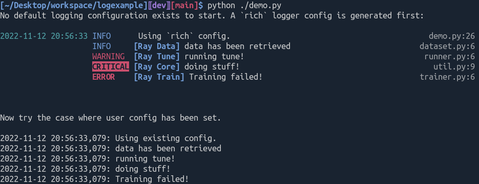

# logexample

An example of a library that includes logging for submodules.

To see how the logging configuration for this example package works, try running
`python ./demo.py` from the root of the repo.

If `rich` is installed good looking log messages are generated. If not, a simple
fallback is used. If the user specifies a configuration for the root logger, the
user configuration is used.
